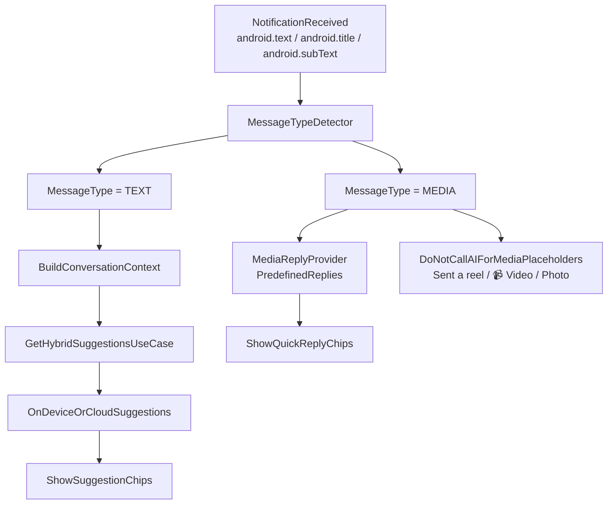

# Media Message Handling Flow

This flow prevents poor UX by avoiding AI calls when incoming notifications are media placeholders (for example: `Sent a reel`, `📹 Video`, `Photo`).

## Notes
- TEXT messages continue through the existing hybrid AI pipeline.
- MEDIA messages skip AI completely and use curated reply sets.
- This saves token cost and avoids irrelevant/random suggestions.
